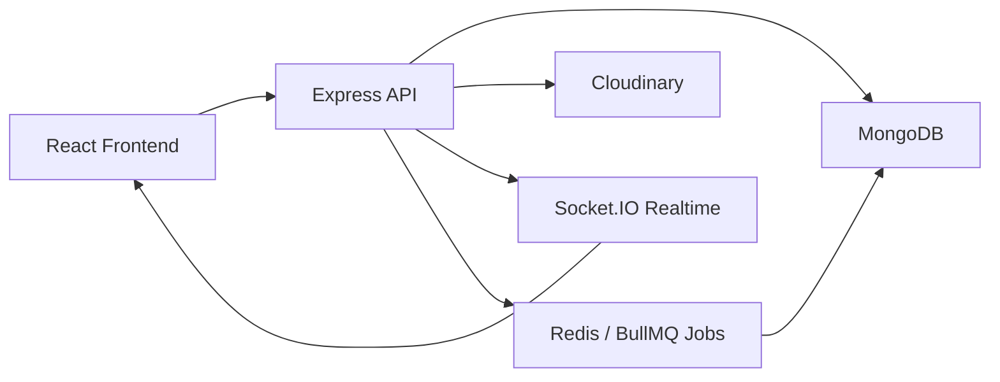

# BidMate

A real-time auction marketplace built with the MERN stack. Users can create auctions, place manual or automatic bids, and follow live auction updates without refreshing the page.

## Overview

BidMate is a full-stack auction marketplace that simulates a live bidding experience with secure authentication, dynamic product listings, and real-time auction updates.

## Features

- JWT authentication with protected routes
- Create, edit, and manage auctions
- Real-time bidding with Socket.IO
- Automatic proxy bidding with configurable maximums
- Price-based minimum bid increments
- Anti-sniping auction extensions
- Live countdowns and outbid notifications
- Buyer and seller activity in the user profile
- Search, category filters, status filters, sorting, and pagination
- Multiple image uploads through Cloudinary
- Rate limiting and security headers
- MongoDB transaction-based bid validation
- Optional Redis and BullMQ auction jobs

## Screenshots

### Home page


### Auction listing feed


### Login flow


### Create auction form


## Tech Stack

| Layer | Technology |
| --- | --- |
| Frontend | React, Vite, React Router |
| Styling | Tailwind CSS |
| Backend | Node.js, Express.js |
| Real-time | Socket.IO |
| Database | MongoDB, Mongoose |
| Storage | Cloudinary |
| Jobs | Redis, BullMQ |
| Testing | Node.js test runner, k6 |

## Architecture



### System responsibilities

| Component | Responsibility |
| --- | --- |
| Client | Browse listings, bid, create auctions, view live updates |
| API Server | Auth, validation, auction lifecycle, bid rules |
| MongoDB | Persist auctions, users, bids, seller state |
| Socket.IO | Push bid and status updates to active users |
| Cloudinary | Store and serve auction images |
| Redis + BullMQ | Background job orchestration and auction closing |

## Project Structure

```text
BidMate/
├── client/       React and Vite frontend
├── server/       Express API and Socket.IO server
├── loadtest/     k6 load-test scripts
└── README.md     Project overview
```

## Requirements

- Node.js 20 or newer
- MongoDB Atlas or another MongoDB replica set
- Cloudinary account for auction images
- Redis for BullMQ jobs (optional)

MongoDB transactions require a replica set. MongoDB Atlas is supported by default; a standalone local MongoDB instance is not sufficient for bidding transactions.

## Local Setup

### 1. Install dependencies

```bash
cd client
npm install

cd ../server
npm install
```

### 2. Configure the client

Create `client/.env`:

```env
VITE_API_URL=http://localhost:5000/api
VITE_SOCKET_URL=http://localhost:5000
```

### 3. Configure the server

Create `server/.env`:

```env
PORT=5000
MONGO_URI=mongodb+srv://<user>:<password>@<cluster>/<database>
JWT_SECRET=replace-with-a-long-random-secret
CLIENT_URL=http://localhost:5173

CLOUDINARY_CLOUD_NAME=
CLOUDINARY_API_KEY=
CLOUDINARY_API_SECRET=

REDIS_URL=
ANTI_SNIPE_MINUTES=2
TRUST_PROXY=1
```

### 4. Start the server

```bash
cd server
npm run dev
```

### 5. Start the client

```bash
cd client
npm run dev
```

Open the Vite URL shown in the terminal, usually `http://localhost:5173`.

## API Overview

| Method | Route | Auth | Description |
| --- | --- | --- | --- |
| POST | `/api/auth/register` | No | Register a user |
| POST | `/api/auth/login` | No | Login and get JWT |
| GET | `/api/auctions` | No | Browse/filter auctions |
| GET | `/api/auctions/:id` | No | Get auction details |
| POST | `/api/auctions` | Yes | Create auction |
| PUT | `/api/auctions/:id` | Seller | Edit upcoming auction |
| DELETE | `/api/auctions/:id` | Seller | Delete auction |
| GET | `/api/bids/:auctionId` | No | View bid history |
| POST | `/api/bids/:auctionId` | Yes | Place a bid |
| GET | `/api/bids/:auctionId/auto` | Yes | View auto-bid |
| POST | `/api/bids/:auctionId/auto` | Yes | Set or update auto-bid |

## Bidding Rules

- The first bid can equal the starting price.
- Later bids must meet the minimum increment.
- A seller cannot bid on their own auction.
- The highest bidder cannot place another manual bid until outbid.
- Auto-bids never exceed the configured maximum.
- Bids near the end can trigger anti-snipe extensions.

## Testing

```bash
cd server
npm test
```

The load test workflow is documented in `loadtest/README.md` and uses k6 for concurrent bidding scenarios.

## Security Notes

- Store secrets in environment variables, not in source control.
- Restrict `CLIENT_URL` to trusted frontend origins in production.
- Keep rate limiting enabled outside local load testing.
- Use HTTPS in production deployments.

## Roadmap

- Google OAuth login
- Watchlists and saved searches
- Email and push notifications
- Admin moderation tools
- Payment processing for won auctions
- Reporting and analytics

## License

This project is currently available for portfolio and educational use. Add a formal license before accepting external contributions.
