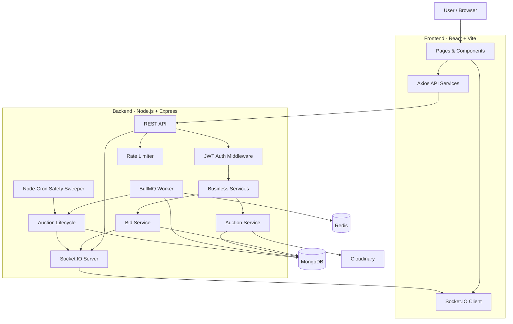
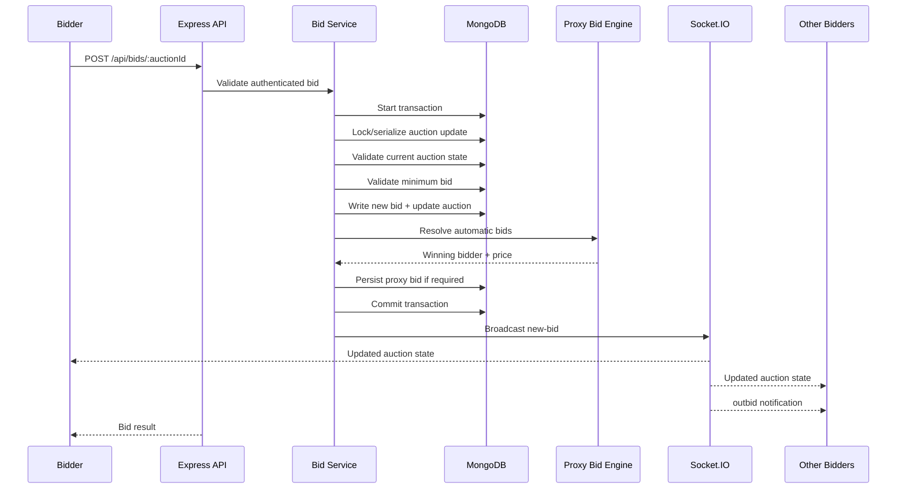
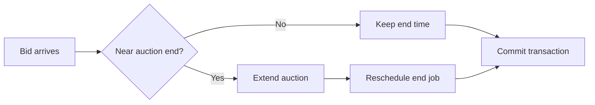
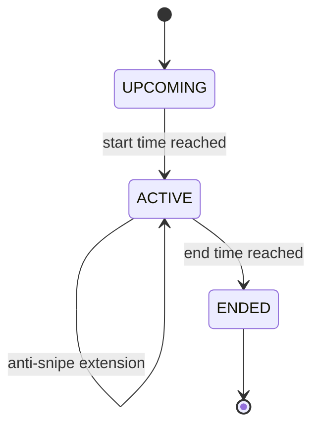
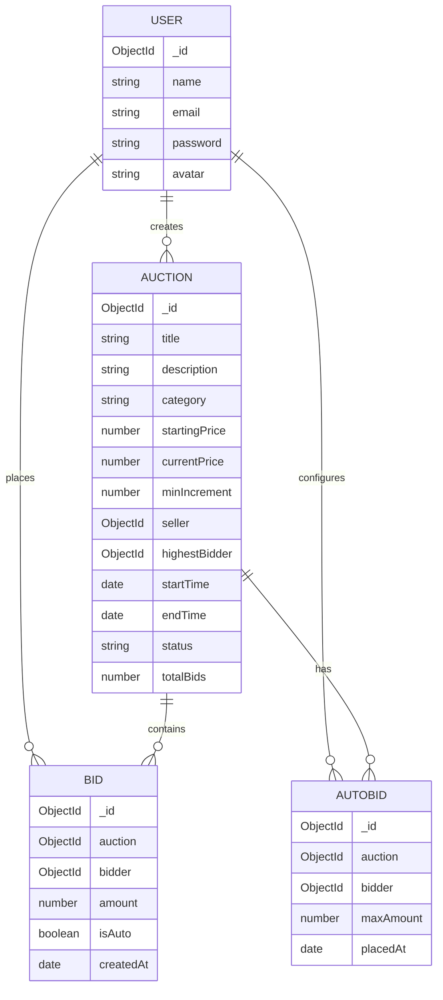

# BidMate

> **Real-time auction marketplace built with the MERN stack**

BidMate is a full-stack, real-time auction platform where users can create auctions, place manual bids, configure automatic/proxy bids, and receive live auction updates without refreshing the page.

The project focuses on the engineering challenges behind a live bidding system: **concurrent bid handling, transactional consistency, automatic bidding, anti-sniping, real-time events, auction lifecycle management, rate limiting, and background jobs**.

---

## Overview

BidMate supports two primary roles:

- **Seller:** create and manage upcoming auctions and upload product images.
- **Bidder:** browse auctions, place bids, configure automatic bidding, and receive real-time updates.

Bidding is handled as a concurrency-sensitive operation using MongoDB transactions and auction-level writes.

---

## Key Features

| Feature | Description |
|---|---|
| 🔐 Authentication | JWT-based registration, login, and protected routes |
| 🏷️ Auction Management | Create, edit, delete, browse, filter, sort, and paginate auctions |
| 💰 Manual Bidding | Validates bid amount, auction state, seller restrictions, and minimum increments |
| 🤖 Automatic / Proxy Bidding | Users define a maximum amount and BidMate automatically responds to competing bids |
| ⚡ Real-Time Updates | Socket.IO broadcasts new bids, outbid events, auction starts, and auction endings |
| ⏱️ Anti-Sniping | Bids placed near the end of an auction can extend its end time |
| 🕐 Auction Lifecycle | Upcoming → Active → Ended state transitions |
| ☁️ Image Uploads | Multiple auction images stored using Cloudinary |
| 🛡️ Rate Limiting | Separate limits for API traffic, authentication, auction creation, and bidding |
| 🔄 Background Jobs | Optional Redis + BullMQ jobs for accurate auction start/end scheduling |
| 🧹 Safety Sweeper | Cron-based fallback for auctions that were not processed by the job queue |
| 🧪 Automated Tests | Unit/integration-style tests for bidding, proxy bidding, queries, and rate limiting |
| 📈 Load Testing | k6 scenario for concurrent bidding against a single auction |

---

# System Architecture



## Architecture Responsibilities

| Layer | Responsibility |
|---|---|
| **React Client** | UI, routing, forms, auction pages, API calls, and real-time state updates |
| **Express API** | HTTP routing, request handling, authentication, validation, and error responses |
| **Controllers** | Translate HTTP requests into service calls and format API responses |
| **Services** | Core business logic such as auction management, bidding, proxy bidding, and lifecycle operations |
| **MongoDB / Mongoose** | Persistent storage for users, auctions, bids, and automatic-bid configurations |
| **Socket.IO** | Pushes live bid and auction-status events to connected clients |
| **Redis / BullMQ** | Schedules auction start/end jobs and provides a background worker |
| **Node-Cron** | Safety-net sweeper that checks for auctions that need to start or end |
| **Cloudinary** | Stores and serves uploaded auction images |
| **Rate Limiter** | Protects authentication, bidding, auction creation, and general API endpoints |

---

# Bidding Architecture

The most important part of BidMate is the concurrent bidding flow.



### Why transactions matter

Multiple users can submit bids at nearly the same time. BidMate therefore does not simply:

1. Read the current price.
2. Calculate a new price.
3. Write the result.

Instead, the bid operation runs inside a **MongoDB transaction** and performs a real auction-document write so competing operations on the same auction are serialized.

This helps prevent lost updates when several bidders compete concurrently.

---

# Automatic / Proxy Bidding

Users can specify a maximum amount instead of manually increasing their bid every time they are outbid.

Example:

```text
Current price:       ₹1,000
Minimum increment:   ₹100

Bidder A max:        ₹2,000
Bidder B max:        ₹1,600
```

BidMate's proxy-bidding logic compares active maximums and determines the current winning bidder and price.

The proxy-bidding algorithm is kept separate from database code so that its core rules can be tested independently.

### Tie handling

When two bidders have the same maximum amount, the earlier committed maximum takes precedence.

---

# Anti-Sniping

BidMate supports auction extensions when bidding happens close to the scheduled end time.



This prevents the auction from ending immediately because of a last-second bid and gives competing bidders an opportunity to respond.

The extension duration is configurable through:

```env
ANTI_SNIPE_MINUTES=2
```

---

# Auction Lifecycle



Auction lifecycle processing has two mechanisms:

1. **Redis + BullMQ** — preferred background scheduling path when `REDIS_URL` is configured.
2. **Node-Cron sweeper** — safety net that runs every minute and catches missed transitions.

The lifecycle operations are idempotent, so repeated checks do not repeatedly close or start the same auction.

---

# Real-Time Architecture

BidMate uses Socket.IO for live updates.

### Auction rooms

Each auction has its own Socket.IO room:

```text
auctionId
```

Users viewing an auction join that room.

Authenticated users can also join a personal room:

```text
user:<userId>
```

### Events

| Event | Purpose |
|---|---|
| `join-auction` | Subscribe to an auction's live updates |
| `leave-auction` | Leave an auction room |
| `new-bid` | Broadcast updated price, bid count, bidder, and end time |
| `outbid` | Notify a user that another bidder has overtaken them |
| `auction-started` | Notify viewers that an auction is now active |
| `auction-ended` | Notify viewers that an auction has ended |
| `auction-won` | Notify the winning user |

---

# Tech Stack

## Frontend

| Technology | Purpose |
|---|---|
| **React 19** | Component-based user interface |
| **Vite** | Development server and production build tooling |
| **React Router** | Client-side routing and protected pages |
| **Tailwind CSS** | Utility-first styling |
| **Axios** | REST API communication |
| **Socket.IO Client** | Real-time auction updates |
| **Lucide React** | UI icons |
| **React Hot Toast** | User notifications |

## Backend

| Technology | Purpose |
|---|---|
| **Node.js** | JavaScript runtime |
| **Express 5** | REST API framework |
| **MongoDB** | Primary database |
| **Mongoose** | MongoDB ODM, schemas, queries, and transactions |
| **JWT** | Authentication tokens |
| **bcryptjs** | Password hashing |
| **Socket.IO** | Real-time bid and auction events |
| **Multer** | Multipart image upload handling |
| **Cloudinary** | Image storage and delivery |
| **node-cron** | Auction lifecycle safety sweeper |

## Infrastructure / Testing

| Technology | Purpose |
|---|---|
| **Redis** | Background job storage |
| **BullMQ** | Auction lifecycle job queue and worker |
| **k6** | Concurrent bidding load testing |
| **Node.js Test Runner** | Automated backend tests |
| **Nodemon** | Backend development workflow |

---

# Data Model



---

# Project Structure

```text
BidMate/
│
├── client/
│   ├── public/
│   └── src/
│       ├── components/
│       │   ├── AuctionCard.jsx
│       │   ├── Layout.jsx
│       │   ├── Navbar.jsx
│       │   └── ProtectedRoute.jsx
│       │
│       ├── pages/
│       │   ├── Home.jsx
│       │   ├── Login.jsx
│       │   ├── Register.jsx
│       │   ├── Profile.jsx
│       │   ├── CreateAuction.jsx
│       │   ├── AuctionDetails.jsx
│       │   └── EditAuction.jsx
│       │
│       ├── services/
│       │   ├── authService.js
│       │   ├── auctionService.js
│       │   ├── bidService.js
│       │   ├── http.js
│       │   └── socket.js
│       │
│       ├── App.jsx
│       └── main.jsx
│
├── server/
│   ├── src/
│   │   ├── config/
│   │   ├── constants/
│   │   ├── controllers/
│   │   ├── jobs/
│   │   ├── middleware/
│   │   ├── models/
│   │   ├── queues/
│   │   ├── routes/
│   │   ├── services/
│   │   ├── utils/
│   │   ├── app.js
│   │   ├── server.js
│   │   └── socket.js
│   │
│   └── tests/
│       ├── auctionQuery.test.js
│       ├── bidService.flow.test.js
│       ├── proxyBidding.test.js
│       └── rateLimiter.test.js
│
├── loadtest/
│   ├── k6-bids.js
│   └── README.md
│
└── README.md
```

---

# API Overview

## Authentication

| Method | Endpoint | Auth | Description |
|---|---|---|---|
| `POST` | `/api/auth/register` | Public | Register a new user |
| `POST` | `/api/auth/login` | Public | Authenticate and receive JWT |
| `GET` | `/api/auth/profile` | Required | Get authenticated user |

## Auctions

| Method | Endpoint | Auth | Description |
|---|---|---|---|
| `GET` | `/api/auctions` | Public | Browse, search, filter, sort, and paginate auctions |
| `GET` | `/api/auctions/:id` | Public | Get auction details |
| `POST` | `/api/auctions` | Required | Create an auction |
| `PUT` | `/api/auctions/:id` | Seller | Update an upcoming auction |
| `DELETE` | `/api/auctions/:id` | Seller | Delete an upcoming auction |
| `GET` | `/api/auctions/my-auctions` | Required | Get auctions created by the user |
| `GET` | `/api/auctions/won` | Required | Get auctions won by the user |

## Bidding

| Method | Endpoint | Auth | Description |
|---|---|---|---|
| `GET` | `/api/bids/my-bids` | Required | Get user's bidding history |
| `GET` | `/api/bids/:auctionId` | Public | Get auction bid history |
| `GET` | `/api/bids/:auctionId/auto` | Required | Get user's auto-bid configuration |
| `POST` | `/api/bids/:auctionId` | Required | Place a manual bid |
| `POST` | `/api/bids/:auctionId/auto` | Required | Create or raise an automatic bid maximum |

---

# Core Bidding Rules

BidMate enforces the following rules on the server:

- The first bid must meet the auction's current price.
- Later bids must satisfy the configured minimum increment.
- Sellers cannot bid on their own auctions.
- The current highest bidder cannot manually bid against themselves.
- Automatic bids cannot exceed the user's configured maximum.
- Existing automatic-bid limits can only be increased.
- Bids are rejected once the auction is no longer open.
- Last-minute bids can extend the auction according to the anti-sniping configuration.

---

# Security & Rate Limiting

- JWT authentication for protected routes
- bcrypt password hashing
- CORS configuration
- Request body limits
- Rate limiting for API, authentication, bidding, and auction creation
- MongoDB transactions for bid consistency
- Upload limits for auction images
- Graceful server and database shutdown

### Rate Limits

| Area | Limit |
|---|---|
| General API | 300 requests / minute |
| Login | 10 attempts / 15 minutes |
| Registration | 20 requests / 15 minutes |
| Bidding | 60 requests / minute |
| Auction creation | 10 auctions / hour |

For load testing:

```env
RATE_LIMIT_DISABLED=true
```

---

# Testing

Run the backend test suite:

```bash
cd server
npm test
```

The test suite covers important backend behavior including:

- Auction query/filter logic
- Bid service flows
- Proxy-bidding decisions
- Rate limiting

---

# Concurrent Bidding Load Test

BidMate includes a k6 scenario designed to stress multiple bidders competing for the same auction.

The test uses ramping virtual users and validates that the server does not produce unexpected server errors during contention.

```bash
# Start server with rate limiting disabled
cd server
RATE_LIMIT_DISABLED=true npm run dev
```

Create test data:

```bash
node scripts/loadtestSetup.js --bidders 200
```

Run k6:

```bash
k6 run -e BASE_URL=http://localhost:5000/api loadtest/k6-bids.js
```

Verify the resulting auction:

```bash
node scripts/loadtestVerify.js <auctionId>
```

> Run load tests against a dedicated test database, never production.

---

# Environment Variables

## Client

Create `client/.env`:

```env
VITE_API_URL=http://localhost:5000/api
VITE_SOCKET_URL=http://localhost:5000
```

## Server

Create `server/.env`:

```env
PORT=5000

MONGO_URI=mongodb+srv://<user>:<password>@<cluster>/<database>

JWT_SECRET=replace-with-a-long-random-secret

CLIENT_URL=http://localhost:5173

CLOUDINARY_CLOUD_NAME=
CLOUDINARY_API_KEY=
CLOUDINARY_API_SECRET=

REDIS_URL=

ANTI_SNIPE_MINUTES=2

TRUST_PROXY=1
```

### Database requirement

Bid placement uses MongoDB transactions, so use MongoDB Atlas or another MongoDB deployment with replica-set support.

Redis is optional. Without `REDIS_URL`, auction lifecycle processing falls back to the cron sweeper.

---

# Local Development

### 1. Clone the repository

```bash
git clone <your-repository-url>
cd BidMate
```

### 2. Install frontend dependencies

```bash
cd client
npm install
```

### 3. Install backend dependencies

```bash
cd ../server
npm install
```

### 4. Configure environment variables

Create:

```text
client/.env
server/.env
```

using the examples above.

### 5. Start the backend

```bash
cd server
npm run dev
```

### 6. Start the frontend

Open another terminal:

```bash
cd client
npm run dev
```

The frontend normally runs at:

```text
http://localhost:5173
```

and the API at:

```text
http://localhost:5000
```

---
